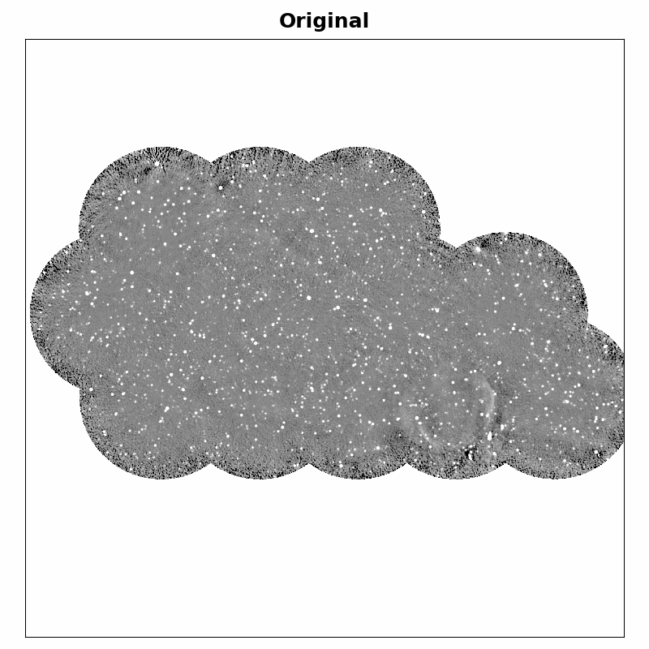
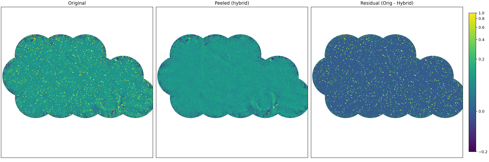
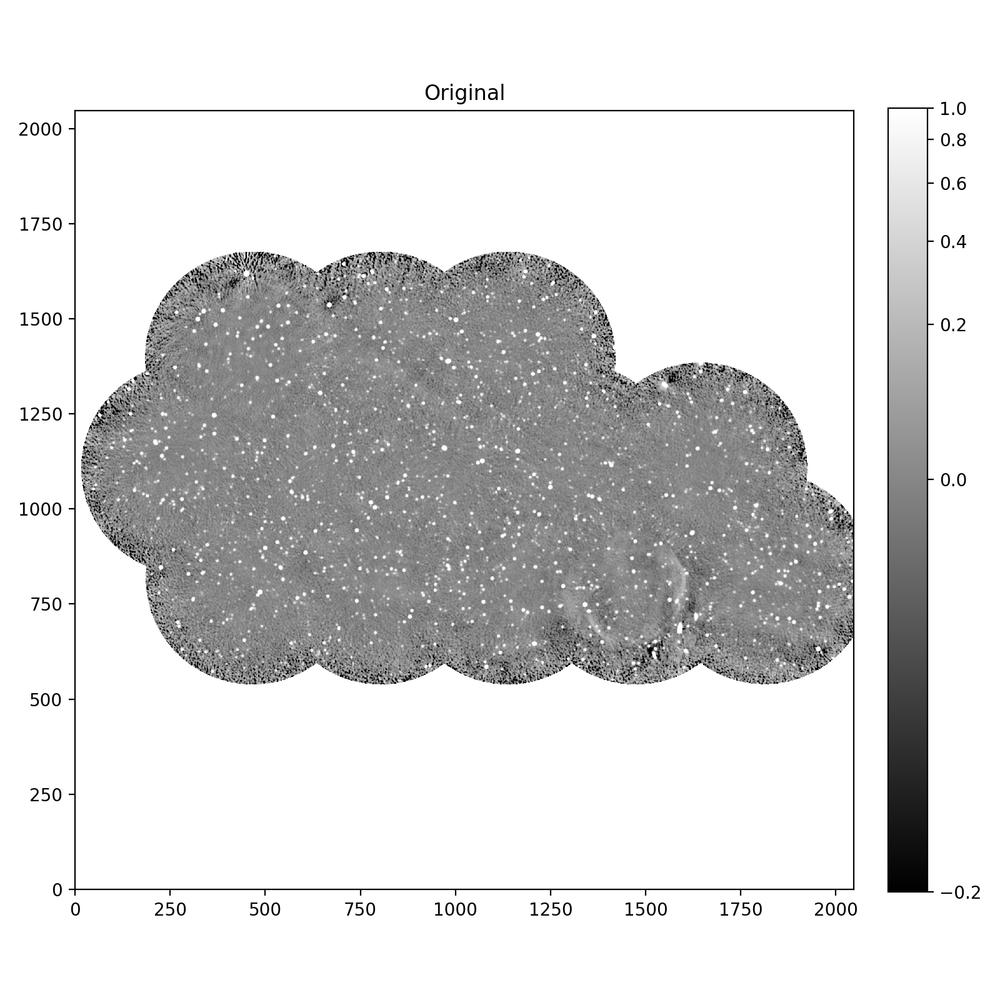
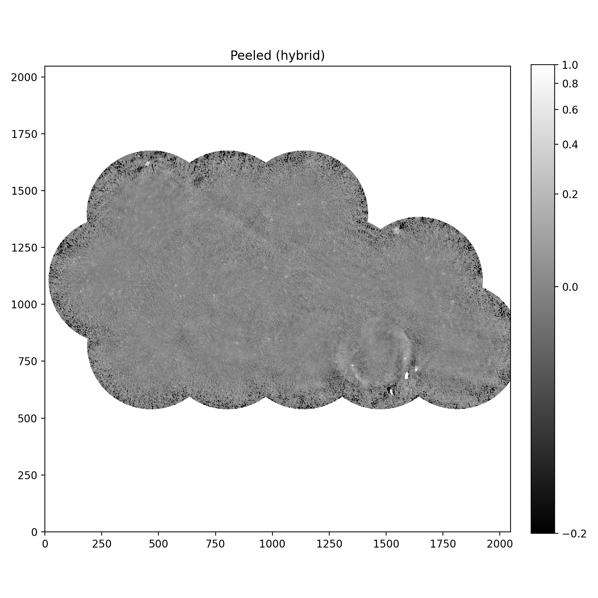
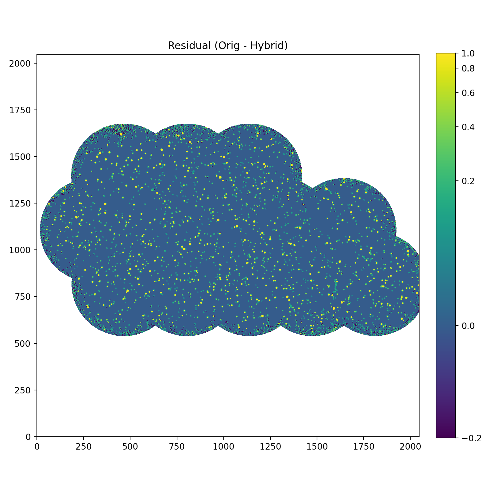

# peel — Point-source Extraction and Excision via band-Limited interpolation

**peel** is a Python tool for detecting compact point sources and extended compact sources in 2D astronomical images, masking them, and filling via iterative band-limited Fourier interpolation.

## Overview

The core algorithm:

1. **Detect** compact sources using global, local, or hybrid detection modes
2. **Mask** the detected sources with circular or box-shaped regions around each peak
3. **Fill** masked pixels via iterative Gercberg-Papoulis-style inpainting:
   - Zero (or seed with previous iteration) the masked pixels
   - FFT transform the image
   - Apply freq-domain low-pass filter (hard or Gaussian)
   - IFFT back to spatial domain
   - Restore measured pixels at unmasked locations
   - Repeat until convergence

The result is a noise-statistics-consistent inpainting of source-masked regions.

## Example Output

### Peeling Animation



*Animating between original and peeled (hybrid) images of G159 at 21 cm, 90 arcsec resolution.*

### Comparison Panel



### Individual Panels

| Original | Peeled (hybrid) | Residual (Orig - Hybrid) |
|---|---|---|
|  |  |  |

## Installation

```bash
git clone https://github.com/wasimraja81/peel.git
cd peel
python -m venv venv
source venv/bin/activate
pip install numpy astropy scipy
```

## Usage

### Basic example

```bash
python peel.py input.fits -o output_inpainted.fits
```

### Recommended hybrid detection with Gaussian filtering

```bash
python peel.py input.fits \
  --detection-mode hybrid \
  --sigma-threshold 4.5 \
  --global-sigma-threshold 5.0 \
  --psf-radius 5 \
  --cutoff 0.10 \
  --lowpass-mode gaussian \
  --iterations 20 \
  --seed-with-bright \
  --mask-output mask.fits \
  -o output_inpainted.fits
```

## Command-Line Options

### Input/Output
- `input_fits`: Path to input FITS image
- `-o, --output-fits`: Output FITS path (default: `<input>_inpainted.fits`)
- `--hdu`: HDU index to read (default: 0)
- `--mask-output`: Path to save the binary mask used for filling

### Detection
- `--detection-mode {global|local|hybrid}` (default: global)
  - **global**: Single-image-wide median/MAD thresholding. Best for bright point sources.
  - **local**: Spatially varying background and noise. Best for larger or embedded sources.
  - **hybrid**: Union of local and global detections. Best for mixed source populations.

- `--sigma-threshold` (default: 5.0)
  - Detection threshold for **local** detector: pixels must be > σ_threshold × σ_local above background

- `--global-sigma-threshold` (default: 5.0)
  - Detection threshold for **global** detector (hybrid mode only): pixels must be > σ_threshold × σ_global

- `--local-bg-sigma` (default: 20.0)
  - Gaussian smoothing σ for local background estimate (pixels)

- `--local-noise-sigma` (default: 8.0)
  - Gaussian smoothing σ for local noise map (pixels)

- `--detect-smooth-sigma` (default: 0.0)
  - Optional pre-detection smoothing to suppress single-pixel noise

- `--seed-with-bright`
  - Use all significantly bright pixels as seeds (vs. only local peaks). Improves large source recovery but risks overmasking diffuse emission.

### Source Masking
- `--psf-radius` (default: 2)
  - Radius (pixels) of circular mask around each detected peak

- `--box-size` (default: 0, disabled)
  - If > 1, use a square box of this size instead of circular mask. Overrides `--psf-radius`.

### Interpolation
- `--cutoff` (default: 0.12)
  - Low-pass cutoff frequency (cycles/pixel). Lower = smoother interpolation.

- `--lowpass-mode {hard|gaussian}` (default: gaussian)
  - **hard**: Step-function cutoff (can cause ringing)
  - **gaussian**: Smooth Gaussian taper (recommended)

- `--iterations` (default: 8)
  - Number of FFT→filter→IFFT cycles. Higher = better convergence, more computation.

### Special Options
- `--include-nans`
  - Also fill original NaN pixels in addition to source masks. Use with caution; large NaN regions can contaminate the FFT.

## Recommended Settings

For extended radio observations with compact sources and diffuse emission:

```bash
python peel.py image.fits \
  --detection-mode hybrid \
  --sigma-threshold 4.5 \
  --global-sigma-threshold 5.0 \
  --local-bg-sigma 20 \
  --local-noise-sigma 8 \
  --detect-smooth-sigma 1.0 \
  --psf-radius 5 \
  --cutoff 0.10 \
  --lowpass-mode gaussian \
  --iterations 20 \
  --seed-with-bright \
  -o output.fits --mask-output mask.fits
```

## Quick Tuning Cheatsheet

For maps similar to `g159.c21.90arc.fits` (about 20 arcsec/pixel), a 90 arcsec beam spans ~4.5 pixels. In practice, `--psf-radius 3-5` is usually a good starting range.

### Preset A: Conservative (avoid overmasking)

```bash
python peel.py image.fits \
  --detection-mode global \
  --sigma-threshold 5.5 \
  --psf-radius 3 \
  --cutoff 0.12 \
  --lowpass-mode gaussian \
  --iterations 12 \
  -o output_conservative.fits
```

### Preset B: Balanced (recommended default)

```bash
python peel.py image.fits \
  --detection-mode hybrid \
  --sigma-threshold 4.5 \
  --global-sigma-threshold 5.0 \
  --local-bg-sigma 20 \
  --local-noise-sigma 8 \
  --detect-smooth-sigma 1.0 \
  --psf-radius 5 \
  --cutoff 0.10 \
  --lowpass-mode gaussian \
  --iterations 20 \
  --seed-with-bright \
  -o output_balanced.fits --mask-output mask_balanced.fits
```

### Preset C: Aggressive (crowded/faint compact sources)

```bash
python peel.py image.fits \
  --detection-mode hybrid \
  --sigma-threshold 4.0 \
  --global-sigma-threshold 4.5 \
  --local-bg-sigma 18 \
  --local-noise-sigma 7 \
  --detect-smooth-sigma 1.0 \
  --psf-radius 5 \
  --cutoff 0.09 \
  --lowpass-mode gaussian \
  --iterations 20 \
  --seed-with-bright \
  -o output_aggressive.fits --mask-output mask_aggressive.fits
```

### Symptom → What to change

- **Diffuse emission gets removed (overmasking):** increase `--sigma-threshold` by ~0.5 (e.g., `4.5 → 5.0`), disable `--seed-with-bright`, or reduce `--psf-radius`.
- **Faint compact sources remain:** decrease `--sigma-threshold` by ~0.5 (e.g., `4.5 → 4.0`), lower `--global-sigma-threshold`, or enable `--seed-with-bright`.
- **Ringing/edge artefacts near masks:** keep `--lowpass-mode gaussian` and lower `--cutoff` (e.g., `0.10 → 0.08`).
- **Patchy/unstable fills:** increase `--iterations` (e.g., `12 → 20`).
- **Large NaN regions:** avoid `--include-nans` unless necessary; if used, inspect residuals carefully.

## Algorithm Details

### Detection Modes

**Global**: Treats the image as having a single background and noise level. Simple, fast. Best for high-contrast point sources on smooth backgrounds.

**Local**: Estimates spatially varying background (via Gaussian smoothing) and noise (MAD of residuals). Adapted to structure. Best for complex extended emission or embedded sources.

**Hybrid**: Runs both; unions the results. Recovers both small bright peaks (global) and larger extended sources (local).

### Iterative Inpainting

The Gerchberg-Papoulis algorithm enforces two constraints iteratively:
1. Spectral constraint: Limit high-frequency content (band-limit)
2. Data constraint: Preserve measured (unmasked) pixels exactly

On each iteration, masked pixels converge to band-limited values consistent with the surrounding data.

## Visualization

After generating an inpainted image, use the included visualization tool to create publication-ready comparison PNGs:

```bash
python tools/generate_comparison_diagnostics.py original.fits inpainted.fits [output_prefix]
```

This generates:
- Single-panel grayscale and viridis views of original, peeled, and residual images
- 3-panel comparison showing Original, Peeled (hybrid), and Residual with matched color scales
- All NaN regions rendered as white for clean aesthetics
- asinh stretch for enhanced dynamic range visibility

See `tools/README.md` for full documentation and examples.

## Examples

See the `examples/` directory for worked notebooks.

## Demo

Runnable shell demos are in `demo/`:

- `demo/run_hybrid_demo.sh <input.fits>`
- `demo/compare_iterations.sh <input.fits>`

See `demo/README.md` for quickstart usage.

## License

MIT

## Contributing

Issues and pull requests welcome.
